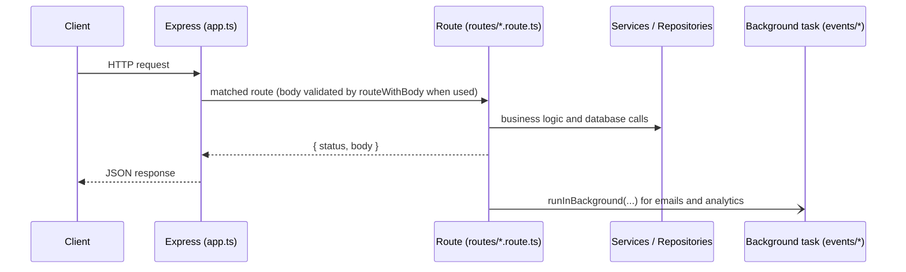

# NeoMath Backend

Express 5 API for NeoMath, run with Bun in development.

## Quick start

```bash
bun install
cp .env.example .env   # then fill in the values
bun run dev            # http://localhost:3000, restarts on changes
```

Check it is up:

```bash
curl http://localhost:3000/health
```

## Scripts

| Command               | What it does                                   |
| --------------------- | ---------------------------------------------- |
| `bun run dev`         | Start the API with file watching               |
| `bun run start`       | Start the API without watching                 |
| `bun run typecheck`   | TypeScript check, no output files              |
| `bun run lint`        | ESLint (not blocking in CI yet, see #14)       |
| `bun run test`        | HTTP test suite on a throwaway local database  |
| `bun run db:generate` | Create a SQL migration from `src/db/schema.ts` |
| `bun run db:migrate`  | Apply pending migrations to `DATABASE_URL`     |
| `bun run db:check`    | Fail if `DATABASE_URL` is missing a migration  |

## Layout

```
src/
  create-app.ts     builds the Express app (CORS, JSON, routes, error handling)
  app.ts            the deployed app with real services; Vercel serves this
  server.ts         local entry point: imports app.ts and calls listen()
  routes/           one file per endpoint, all registered in routes/index.ts
  events/           work that runs after a request (emails, analytics, saving)
  db/               Postgres: Drizzle schema and the one shared connection pool
  modules/          feature modules (ADR-0004): auth/ (service, requireUser and
                    requireAdmin / requireVerifiedEmail middleware, email
                    verification), users/ (repository), rate-limits/ (Postgres
                    fixed-window counters), ai/ and
                    email/ (solver and email sender interfaces); the rest fill in later
  lib/              small shared helpers (http adapter, logger, env, rate limit)
  middlewares/      JWT auth checks
  services/         business logic (auth, AI, email, analytics)
  repositories/     database access
  types/            shared TypeScript types
drizzle/            generated SQL migrations, committed and reviewed
scripts/            one-off admin scripts
tests/              black-box HTTP tests (see tests/README.md)
```

## How a request flows



Routes return a plain `{ status, body }` object. `lib/http.ts` turns that into
the Express response, so routes never touch `res` directly.

## Database migrations

Schema changes always go through committed SQL files (ADR-0002), never
`drizzle-kit push`:

1. Edit `src/db/schema.ts`
2. `bun run db:generate` writes a new file in `drizzle/`
3. Read the SQL, commit it with the schema change
4. `bun run db:migrate` applies it to the database in `DATABASE_URL`

Before running `db:migrate` against Neon (preview or production), show the
SQL to a human first. Tests apply every migration to a fresh local database
on each run, so a broken migration fails the test run.

## Migration status

1. Motia to Express: done
2. Postgres (Drizzle + Neon): done. All data lives in Postgres; the waitlist is removed (open sign-up)
3. Deploy to Vercel: after Phase 2
