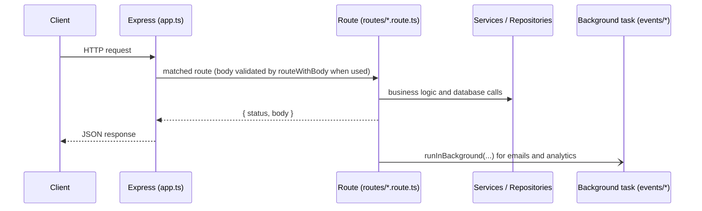

# NeoMath Backend

Express 5 API for NeoMath, run with Bun in development.

## Quick start

```bash
bun install
cp .env.example .env   # then fill in the values
bun run dev            # http://localhost:3000, restarts on changes
```

Check it is up:

```bash
curl http://localhost:3000/health
```

## Scripts

| Command             | What it does                                   |
| ------------------- | ---------------------------------------------- |
| `bun run dev`       | Start the API with file watching               |
| `bun run start`     | Start the API without watching                 |
| `bun run typecheck` | TypeScript check, no output files              |
| `bun run test`      | HTTP test suite (read `tests/README.md` first) |

## Layout

```
src/
  app.ts            builds the Express app (CORS, JSON, routes, error handling)
  server.ts         local entry point, calls listen()
  routes/           one file per endpoint, all registered in routes/index.ts
  events/           work that runs after a request (emails, analytics, saving)
  lib/              small shared helpers (http adapter, logger, env, rate limit)
  middlewares/      JWT auth checks
  services/         business logic (auth, AI, email, analytics)
  repositories/     database access
  types/            shared TypeScript types
scripts/            one-off admin scripts
tests/              black-box HTTP tests
```

## How a request flows



Routes return a plain `{ status, body }` object. `lib/http.ts` turns that into
the Express response, so routes never touch `res` directly.

## Migration status

1. Motia to Express: done
2. MongoDB to Postgres (Drizzle + Neon): next
3. Deploy to Vercel: after Phase 2
