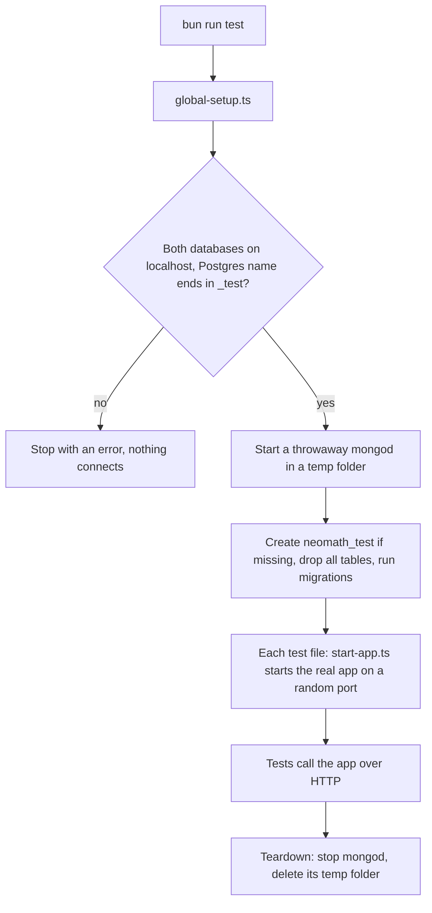

# Backend Test Suite Documentation

## Overview

The brutal test suite (`tests/brutal.test.ts`) is designed to test security vulnerabilities, edge cases, and stress test the NeoMath backend.

## Running Tests

```bash
bun run test          # whole suite, once
bun run test:watch    # re-run on changes
```

You only need Postgres running locally (`brew services start postgresql@17`)
and MongoDB installed (`mongod` on your PATH). Nothing else to start by hand.

### What happens on each run



- **Postgres**: `postgres://localhost:5432/neomath_test` by default. Override
  with `TEST_DATABASE_URL`; it must still point to localhost and the database
  name must end in `_test`, so your dev database can never be wiped.
- **MongoDB**: a fresh `mongod` on a random port, deleted afterwards. Used
  only by features not yet moved to Postgres.
- **Settings**: every secret is a dummy set in `global-setup.ts`. Your real
  `.env` is never loaded (`envDir: false` in `vitest.config.ts`).

### Fakes

Only two things are faked, both outside the app (see `tests/support/`):

| Fake               | Replaces | What tests can do with it                         |
| ------------------ | -------- | ------------------------------------------------- |
| `fakeMathSolver`   | Gemini   | Solving always returns the same Solution          |
| `fakeEmailSender`  | Resend   | Read sent emails: `fakeEmailSender.emailsTo(...)` |

Everything else (routes, repositories, databases, Rate Limits) is real.

### Writing a test

```ts
import { apiUrl, fakeEmailSender } from "./support/test-app";
import { registerUser } from "./support/users";

const { email, accessToken } = await registerUser();
const res = await fetch(apiUrl("/api/profile"), {
  headers: { Authorization: `Bearer ${accessToken}` },
});
```

Use `uniqueEmail()` (or `registerUser()`) so tests never share a User by
accident. Assert on what a User could see (status, body, emails), not on
database rows.

### Known failures

Six older tests in `brutal.test.ts` and `brutal-advanced.test.ts` are marked
`it.skip` with a `// Known failure, see #12` comment. They failed before this
harness too, because of current app behaviour (the solve Rate Limit shared by
tests using the same User, the saved Solution ID differing from the returned
one, an empty admin passcode returning 401, refresh tokens issued in the same
second being identical). #12 tracks fixing and un-skipping them.

## Test Categories

### 🔐 Authentication Tests

- NoSQL injection protection
- SQL injection protection
- JWT token manipulation
- Rate limiting (skipped - infrastructure)
- Password complexity validation
- Email enumeration prevention

### 🧮 Solve API Tests

- Input validation (empty, null, Unicode)
- Concurrent request handling
- Unsolvable problem detection
- AI response timeouts

### 📜 History Tests

- IDOR prevention (user isolation)
- Deletion edge cases
- Clear history functionality

### 👤 Profile Tests

- Privilege escalation prevention
- Mass assignment protection

### 🚨 Error Handling Tests

- No stack trace leakage
- No database info leakage
- Consistent error format

## Test Configuration

Configured in `vitest.config.ts`:

| Setting       | Value   | Purpose                    |
| ------------- | ------- | -------------------------- |
| `testTimeout` | 60000ms | Generous for slow machines |
| `hookTimeout` | 30000ms | Database setup in hooks    |

## Security Patterns Tested

1. **NoSQL Injection** - `{ email: { $gt: "" } }`
2. **SQL Injection** - `admin' OR '1'='1`
3. **XSS** - `<script>alert('xss')</script>`
4. **Prototype Pollution** - `{ __proto__: { isAdmin: true } }`
5. **JWT Manipulation** - Modified payloads, expired tokens

## Test User

Tests use a standard test user:

- Email: `test@test.com`
- Password: `Test123!`

The global `beforeAll` ensures this user exists before tests run.
