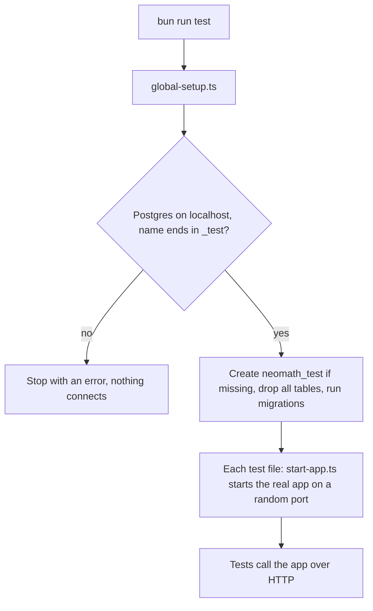

# Backend Test Suite Documentation

## Overview

The brutal test suite (`tests/brutal.test.ts`) is designed to test security vulnerabilities, edge cases, and stress test the NeoMath backend.

## Running Tests

```bash
bun run test          # whole suite, once
bun run test:watch    # re-run on changes
```

You only need Postgres running locally (`brew services start postgresql@17`).
Nothing else to start by hand.

### What happens on each run



- **Postgres**: `postgres://localhost:5432/neomath_test` by default. Override
  with `TEST_DATABASE_URL`; it must still point to localhost and the database
  name must end in `_test`, so your dev database can never be wiped.
- **Settings**: every secret is a dummy set in `global-setup.ts`. Your real
  `.env` is never loaded (`envDir: false` in `vitest.config.ts`).

### Fakes

Only two things are faked, both outside the app (see `tests/support/`):

| Fake               | Replaces | What tests can do with it                         |
| ------------------ | -------- | ------------------------------------------------- |
| `fakeMathSolver`   | Gemini   | Solving always returns the same Solution          |
| `fakeEmailSender`  | Resend   | Read sent emails: `fakeEmailSender.emailsTo(...)` |

Everything else (routes, repositories, databases, Rate Limits) is real.

### Client IPs

Per-IP Rate Limits (sign-up, login) would trip constantly if every test
request came from 127.0.0.1. `start-app.ts` gives each request to the app a
random `X-Forwarded-For` address, like separate visitors behind Vercel's
proxy. A test that checks an IP limit sets the header itself so its requests
share one address (see `tests/rate-limits.test.ts`).

### Writing a test

```ts
import { apiUrl, fakeEmailSender } from "./support/test-app";
import { registerUser } from "./support/users";

const { email, accessToken } = await registerUser();
const res = await fetch(apiUrl("/api/profile"), {
  headers: { Authorization: `Bearer ${accessToken}` },
});
```

Use `uniqueEmail()` (or `registerUser()`) so tests never share a User by
accident. Assert on what a User could see (status, body, emails), not on
database rows.

### Known failures

Two older tests in `brutal-advanced.test.ts` are marked `it.skip` with a
`// Known failure, see #12` comment: the Daily Limit test (the per-minute
solve limit fires first; `tests/solve.test.ts` covers the Daily Limit
instead) and refresh tokens issued in the same second being identical. #12
tracks them.

## Test Categories

### 🔐 Authentication Tests

- NoSQL injection protection
- SQL injection protection
- JWT token manipulation
- Rate limiting (skipped - infrastructure)
- Password complexity validation
- Email enumeration prevention

### 🧮 Solve API Tests

- Input validation (empty, null, Unicode)
- Concurrent request handling
- Unsolvable problem detection
- AI response timeouts

### 📜 History Tests

- IDOR prevention (user isolation)
- Deletion edge cases
- Clear history functionality

### 👤 Profile Tests

- Privilege escalation prevention
- Mass assignment protection

### 🚨 Error Handling Tests

- No stack trace leakage
- No database info leakage
- Consistent error format

## Test Configuration

Configured in `vitest.config.ts`:

| Setting       | Value   | Purpose                    |
| ------------- | ------- | -------------------------- |
| `testTimeout` | 60000ms | Generous for slow machines |
| `hookTimeout` | 30000ms | Database setup in hooks    |

## Security Patterns Tested

1. **NoSQL Injection** - `{ email: { $gt: "" } }`
2. **SQL Injection** - `admin' OR '1'='1`
3. **XSS** - `<script>alert('xss')</script>`
4. **Prototype Pollution** - `{ __proto__: { isAdmin: true } }`
5. **JWT Manipulation** - Modified payloads, expired tokens

## Test User

Tests use a standard test user:

- Email: `test@test.com`
- Password: `Test123!`

The global `beforeAll` ensures this user exists before tests run.
