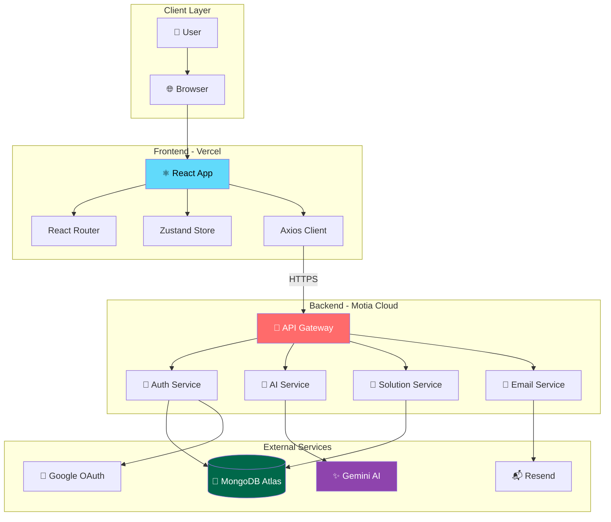
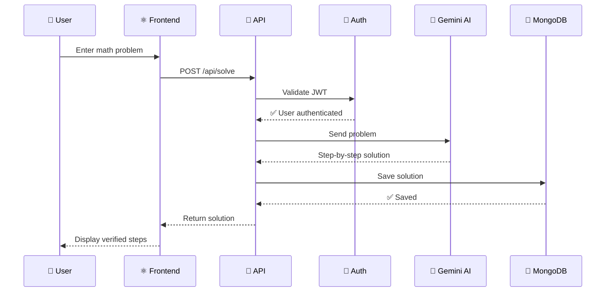
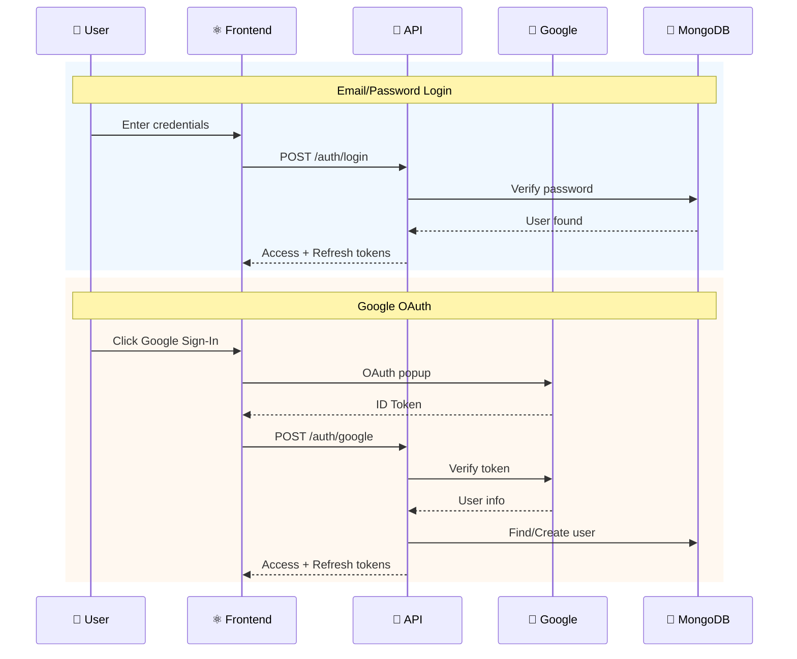
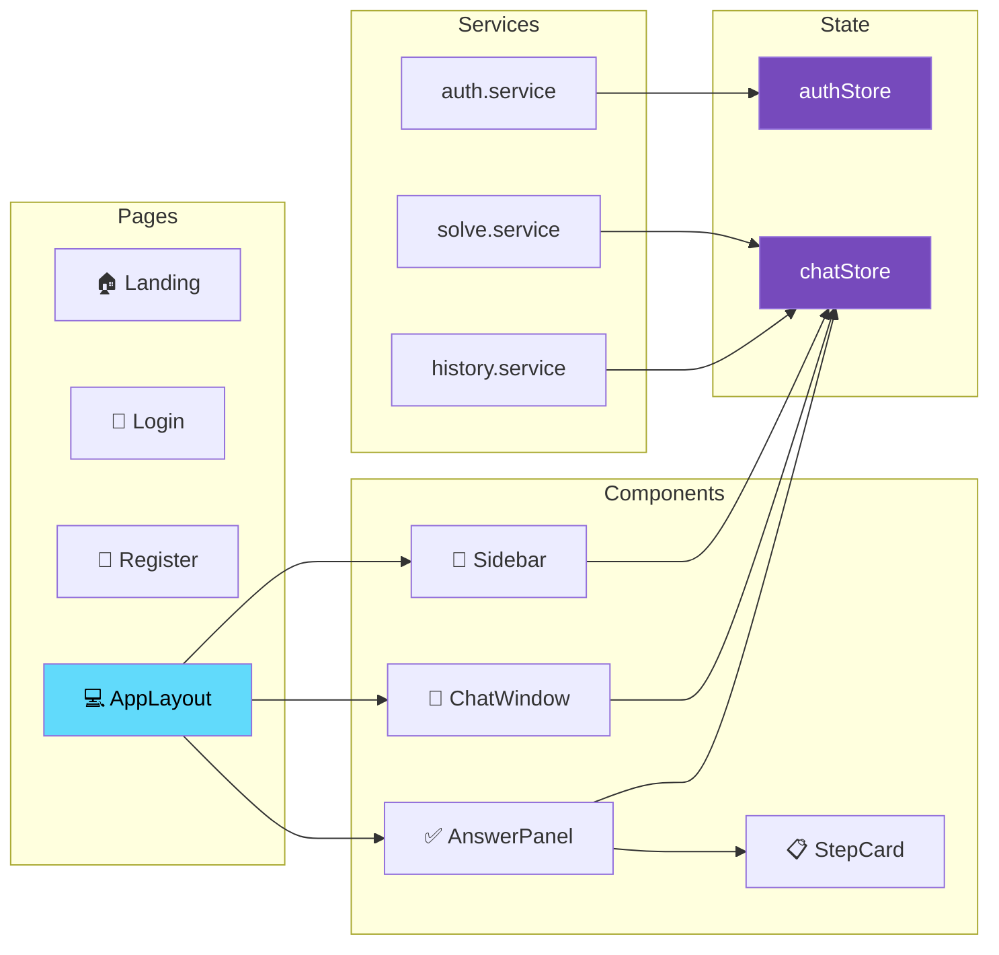
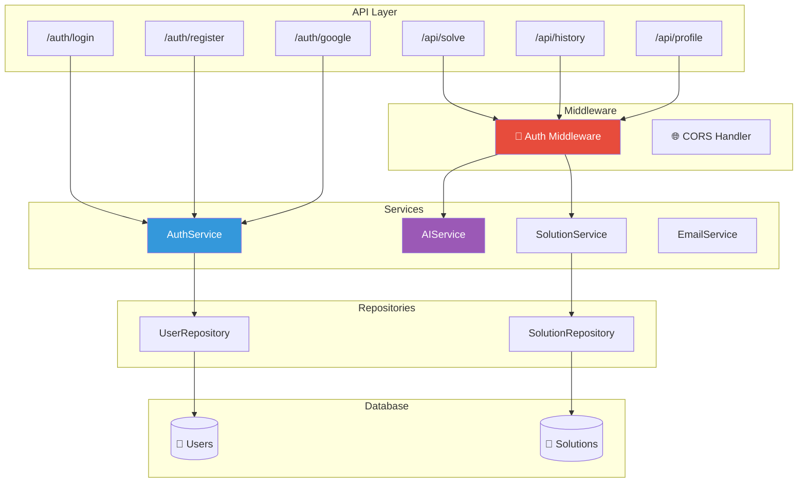
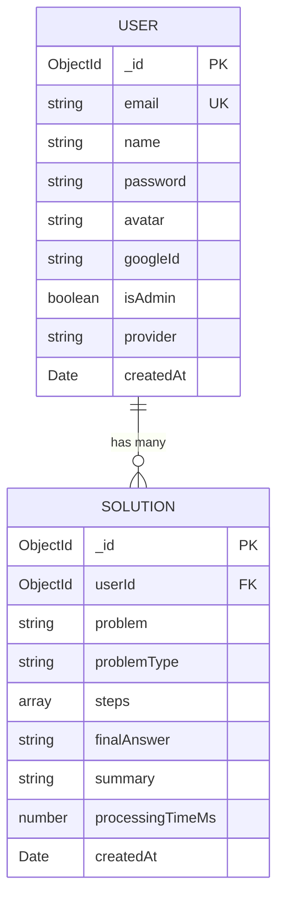
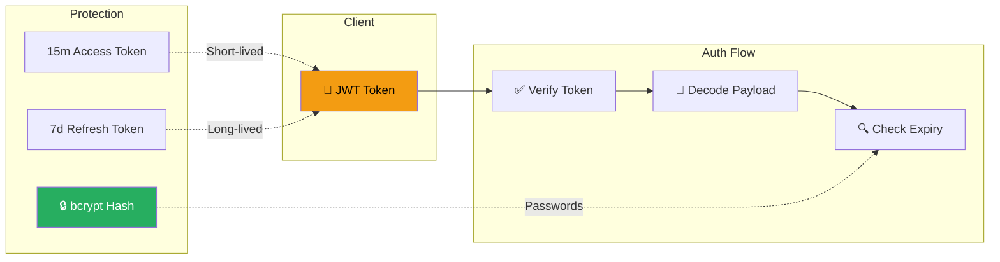
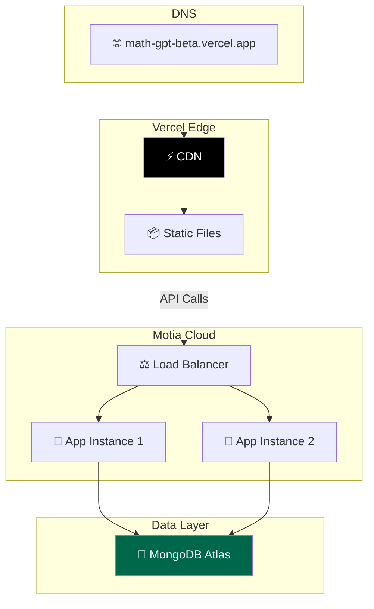

# MathGPT Architecture

> A comprehensive overview of the MathGPT system architecture

---

## System Overview

---

## Request Flow

---

## Authentication Flow

---

## Frontend Architecture

---

## Backend Architecture

---

## Tech Stack

### Frontend

| Technology                                                                                        | Purpose          |
| ------------------------------------------------------------------------------------------------- | ---------------- |
|                  | UI Framework     |
|  | Type Safety      |
|                      | Build Tool       |
|       | Styling          |
|                                           | State Management |

### Backend

| Technology                                                                              | Purpose        |
| --------------------------------------------------------------------------------------- | -------------- |
|                                 | Orchestration  |
|   | Database       |
|  | Authentication |

### External

| Technology                                                                                  | Purpose             |
| ------------------------------------------------------------------------------------------- | ------------------- |
|                        | AI Processing       |
|  | Social Login        |
|                                  | Transactional Email |

---

## Data Models

---

## Security Architecture

---

## Deployment Architecture

---

_Last updated: December 21, 2025_
