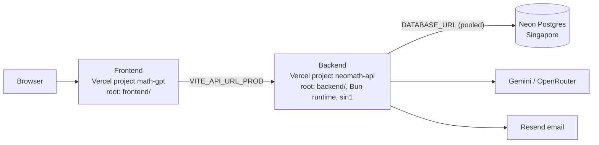

# Deployment Guide

How NeoMath is deployed: two Vercel projects from this repo plus a Neon
Postgres database.

## Overview



| Component | Platform            | Notes                                         |
| --------- | ------------------- | --------------------------------------------- |
| Frontend  | Vercel (`math-gpt`) | Vite, root directory `frontend`               |
| Backend   | Vercel (`neomath-api`) | Express on the Bun runtime, region `sin1`  |
| Database  | Neon                | Postgres in Singapore, next to the functions  |

Both Vercel projects deploy `main` to production and every PR to a preview.

---

## Backend on Vercel

The backend is an Express app. Vercel serves `backend/src/app.ts`: it imports
`express` and default-exports the app, which is what Vercel's Express
detection needs. `src/server.ts` only listens, for local development.
`backend/vercel.json` selects the Bun runtime and the Singapore region.

### Project settings

- **Root Directory:** `backend`
- **Framework Preset:** Express (detected)
- Install and build commands: defaults (Bun is detected from `bun.lock`)

### Environment variables

| Variable               | Value                                                                 |
| ---------------------- | --------------------------------------------------------------------- |
| `DATABASE_URL`         | Neon **pooled** connection string (set by the Neon integration)       |
| `JWT_SECRET`           | Random, `openssl rand -base64 48`                                     |
| `JWT_REFRESH_SECRET`   | Random, different from `JWT_SECRET`                                   |
| `ACCESS_TOKEN_EXPIRY`  | `15m`                                                                 |
| `REFRESH_TOKEN_EXPIRY` | `7d`                                                                  |
| `GOOGLE_CLIENT_ID`     | Google OAuth client id (same as the frontend's)                       |
| `GEMINI_MATH_AI_API`   | Gemini API key                                                        |
| `OPEN_ROUTER_API_KEY`  | OpenRouter key (backup models)                                        |
| `USE_MULTI_MODEL`      | `false` or `true`                                                     |
| `RESEND_API`           | Resend API key                                                        |
| `FROM_EMAIL`           | Verified sender, e.g. `NeoMath <hello@your-domain>`                   |
| `APP_URL`              | Frontend URL used in email links                                      |
| `CORS_ORIGINS`         | Comma-separated frontend URLs allowed to call the API                 |
| `NODE_ENV`             | `production`                                                          |

Never set `EMAIL_TRANSPORT=console` here; the server refuses to start with it
in production.

### Must sit behind a proxy

Per-IP Rate Limits (sign-up, login, Google sign-in) read the client address
from `X-Forwarded-For`, because the app trusts one proxy hop
(`app.set("trust proxy", 1)`). Vercel overwrites that header with the real
client address, so this is safe there. Never expose the API directly (a bare
VPS port, a container without a proxy): clients could then send a fake
address with each request and never hit a limit.

---

## Database on Neon

- One Neon project, region **AWS Asia Pacific (Singapore)**, to match the
  `sin1` functions.
- Connect it with Neon's **Vercel integration**. It sets `DATABASE_URL` on
  the backend project and gives each preview deployment its own database
  branch.
- Use the **pooled** connection string (host contains `-pooler`).

### Migrations

Schema changes are committed SQL files in `backend/drizzle/` (ADR-0002).
They are never applied automatically on deploy:

1. Read the new SQL files in the PR.
2. Run them against the target database on purpose (preview branch first,
   then production):

   ```bash
   cd backend
   DATABASE_URL="<neon connection string>" bun run db:migrate
   ```

3. Deploy the code that needs them.

**Safety net:** the backend's Vercel build step (`vercel-build` in
`backend/package.json`) runs `scripts/check-migrations.ts` against that
environment's `DATABASE_URL`. If the database is missing a migration, the
build fails with the list of missing files and the current deployment keeps
serving, so the live site never runs code ahead of its schema. Apply the
migration, then redeploy. Run the same check locally with
`DATABASE_URL=... bun run db:check`.

Write migrations **additive first**: add tables and columns before code uses
them, and drop old ones only in a later release, so old and new code both
work while a deploy rolls out.

---

## Frontend on Vercel

- **Root Directory:** `frontend`, **Framework Preset:** Vite
- `VITE_API_URL_PROD`: the backend's production URL
- `VITE_GOOGLE_CLIENT_ID`: the Google OAuth client id

## Google OAuth

In Google Cloud Console, add every frontend URL (production and any custom
domain) to **Authorized JavaScript origins** for the OAuth client.

## Admins

Admins sign in normally. Create the first one with:

```bash
cd backend
DATABASE_URL="<neon connection string>" bun run scripts/create-admin.ts
```

Existing Admins grant admin rights to others from the dashboard.

---

## Deployment Checklist

- [ ] Neon project created and connected to the backend project
- [ ] Migrations reviewed and applied to Neon
- [ ] Backend environment variables set
- [ ] Backend preview deployment passes the health check and a sign-up
- [ ] Frontend `VITE_API_URL_PROD` points at the backend
- [ ] Backend `CORS_ORIGINS` includes the frontend URL
- [ ] Google OAuth origins include the frontend URL
- [ ] First Admin created
- [ ] Sign up, verify email, solve, History, admin dashboard all work

## Health Check

```bash
curl https://<backend-url>/health
```

Expected: `{"status":"healthy","timestamp":"..."}`

## Rollback

Both projects: Vercel dashboard, **Deployments**, pick the last good
deployment, **Instant Rollback**. Database migrations are not rolled back
automatically; write a new migration to undo a schema change.
